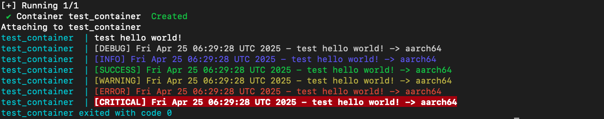

# docker-arch-test
docker multi-arch test 本项目通过 Docker 构建了一个多架构输出信息的测试容器，用于探索 docker 上传 github ghcr.io 镜像仓库所需参数信息。



    
<a href="https://star-history.com/#469138946ba5fa/docker-arch-test&Date">
  <picture>
    <source media="(prefers-color-scheme: dark)" srcset="https://api.star-history.com/svg?repos=469138946ba5fa/docker-arch-test&type=Date&theme=dark" />
    <source media="(prefers-color-scheme: light)" srcset="https://api.star-history.com/svg?repos=469138946ba5fa/docker-arch-test&type=Date" />
    
  </picture>
</a>

## 目录结构

项目工作目录如下：

```
.
├── .env.amd64                 # Docker Compose 配置文件所需 amd64 环境，需要更名为 .env 使用
├── .env.arm64                 # Docker Compose 配置文件所需 arm64 环境，需要更名为 .env 使用
├── docker-compose.yml         # Docker Compose 配置文件，用于多容器编排（例如搭配其它服务时使用）
├── Dockerfile                 # 构建 Docker 镜像的说明文件
├── LICENSE                    # 许可协议文件
├── README.md                  # 本项目说明文档
└── scripts                    # 脚本目录，包含各项自动化安装和启动脚本
    ├── common.sh              # 通用日志、函数等辅助脚本
    └── start_test.sh          # 启动 Test 服务的脚本
```

## 特点

- **多架构信息输出测试**  
  实验测试构建多架构镜像需求。

## 快速入门

### 通过 docker-compose 文件启动（如果你在 docker-compose.yml 中配置了服务）：

修改环境文件比如 .env.arm64 修改完善后，改名为 .env 以支持 docker-compose.yml 文件

```bash
docker-compose up
```

### 通过 docker 启动 test 服务

项目中通过 `tini` 执行 `start_test.sh` 启动 Test 服务。你可以直接进入容器后执行脚本，或在 Docker Compose 设置中指定此命令。启动后，查看打印信息。

例如，通过 docker 运行容器：

```bash
docker run --rm -it ghcr.io/469138946ba5fa/docker-arch-test:latest tini -- "/usr/local/bin/start_test.sh"
```

## 构建 Docker 镜像

你可能需要一些前置条件，比如 docker compose buildx 环境的部署
稍微说一下吧，点到为止  
比如我的机器是 Ubuntu 24.04 LTS (GNU/Linux 6.8.0-57-generic aarch64)

  - **docker 部署过程如下：**

```shell
# 系统可以使用官方一键安装脚本 https://github.com/docker/docker-install
curl -fsSL https://test.docker.com -o test-docker.sh
sh test-docker.sh
# Manage Docker as a non-root user
## 非 root 用户需要加入到 docker 组才有权限使用
# Create the docker group
## 添加 docker 组
sudo groupadd docker
# Add your user to the docker group.
## 将当前用户加入到 docker 组权限
sudo usermod -aG docker ${USER}
# Log out and log back in so that your group membership is re-evaluated.
## 临时进入 docker 组测试，更好的方式是退出并重新登录测试
newgrp docker 
# Configure Docker to start on boot
# 启用 docker 开机自启动服务
sudo systemctl enable docker.service
sudo systemctl enable containerd.service
# satrt
# 开启 docker 服务，其实上一步就启用了
sudo systemctl start docker.service
sudo systemctl start containerd.service
# Verify that Docker Engine is installed correctly by running the hello-world image
# 测试 docker hello-world:latest 打印
docker run --rm hello-world:latest
```

  - **compose 部署更新过程如下：**

```shell
# GitHub 项目 URI
URI="docker/compose"

# 获取最新版本
VERSION=$(curl -sL "https://github.com/${URI}/releases" | grep -Eo '/releases/tag/[^"]+' | awk -F'/tag/' '{print $2}' | head -n 1)
echo "Latest version: ${VERSION}"

# 获取操作系统和架构信息
OS=$(uname -s)
ARCH=$(uname -m)

# 映射平台到官方命名
case "${OS}" in
  Linux)
    PLATFORM="linux"
    if [[ "${ARCH}" == "arm64" || "${ARCH}" == "aarch64" ]]; then
      ARCH="aarch64"
    elif [[ "${ARCH}" == "x86_64" ]]; then
      ARCH="x86_64"
    else
      echo "Unsupported architecture: ${ARCH}"
      echo 'should exit 1'
    fi
    ;;
  *)
    echo "Unsupported OS: ${OS}"
    echo 'should exit 1'
    ;;
esac

# 输出最终平台和架构
echo "Platform: ${PLATFORM}"
echo "Architecture: ${ARCH}"

# 拼接下载链接和校验码链接
TARGET_FILE="docker-compose-${PLATFORM}-${ARCH}"
SHA256_FILE="${TARGET_FILE}.sha256"
URI_DOWNLOAD="https://github.com/${URI}/releases/download/${VERSION}/${TARGET_FILE}"
URI_SHA256="https://github.com/${URI}/releases/download/${VERSION}/${SHA256_FILE}"
echo "Download URL: ${URI_DOWNLOAD}"
echo "SHA256 URL: ${URI_SHA256}"

# 检查文件是否存在
if [[ -f "/tmp/${TARGET_FILE}" ]]; then
  echo "File already exists: /tmp/${TARGET_FILE}"
  
  # 删除旧的 SHA256 文件（如果存在）
  if [[ -f "/tmp/${SHA256_FILE}" ]]; then
    echo "Removing old SHA256 file: /tmp/${SHA256_FILE}"
    rm -fv "/tmp/${SHA256_FILE}"
  fi

  # 下载新的 SHA256 文件
  echo "Downloading SHA256 file..."
  curl -L -C - --retry 3 --retry-delay 5 --progress-bar -o "/tmp/${SHA256_FILE}" "${URI_SHA256}"

  # 校验文件完整性
  # shasum 校验依赖 perl 可能 linux 系统需要手动安装
  echo "Verifying file integrity for /tmp/${TARGET_FILE}..."
  cd /tmp
  if ! shasum -a 256 -c "${SHA256_FILE}"; then
    log_warning "SHA256 checksum failed. Removing file and retrying..."
    rm -fv "/tmp/${TARGET_FILE}"
  else
    echo "File integrity verified successfully."
  fi
fi

# 如果文件不存在或之前校验失败
if [[ ! -f "/tmp/${TARGET_FILE}" ]]; then
  echo "Downloading file..."
  curl -L -C - --retry 3 --retry-delay 5 --progress-bar -o "/tmp/${TARGET_FILE}" "${URI_DOWNLOAD}"

  # 删除旧的 SHA256 文件并重新下载
  if [[ -f "/tmp/${SHA256_FILE}" ]]; then
    echo "Removing old SHA256 file: /tmp/${SHA256_FILE}"
    rm -fv "/tmp/${SHA256_FILE}"
  fi
  echo "Downloading SHA256 file..."
  curl -L --progress-bar -o "/tmp/${SHA256_FILE}" "${URI_SHA256}"

  # 校验完整性
  # shasum 校验依赖 perl 可能 linux 系统需要手动安装
  echo "Verifying file integrity for /tmp/${TARGET_FILE}..."
  cd /tmp
  if ! shasum -a 256 -c "${SHA256_FILE}"; then
    echo "Download failed: SHA256 checksum does not match."
    echo 'should exit 1'
  else
    echo "File integrity verified successfully."
  fi
fi

sudo mv -fv "/tmp/${TARGET_FILE}" /usr/local/bin/docker-compose
# Apply executable permissions to the binary
## 赋予执行权
sudo chmod -v +x /usr/local/bin/docker-compose
# create a symbolic link to /usr/libexec/docker/cli-plugins/
# 创建插件目录和软链接
sudo mkdir -pv /usr/libexec/docker/cli-plugins/
sudo ln -sfv /usr/local/bin/docker-compose /usr/libexec/docker/cli-plugins/docker-compose
# Test the installation.
## 测试版本打印
docker-compose version
docker compose version
```

  - **buildx 部署更新过程如下：**

```shell
# GitHub 项目 URI
URI="docker/buildx"

# 获取最新版本
VERSION=$(curl -sL "https://github.com/${URI}/releases" | grep -Eo '/releases/tag/[^"]+' | awk -F'/tag/' '{print $2}' | head -n 1)
echo "Latest version: ${VERSION}"

# 获取操作系统和架构信息
OS=$(uname -s)
ARCH=$(uname -m)

# 映射平台到官方命名
case "${OS}" in
  Linux)
    PLATFORM="linux"
    if [[ "${ARCH}" == "arm64" || "${ARCH}" == "aarch64" ]]; then
      ARCH="arm64"
    elif [[ "${ARCH}" == "x86_64" ]]; then
      ARCH="amd64"
    else
      echo "Unsupported architecture: ${ARCH}"
      echo 'should exit 1'
    fi
    ;;
  *)
    echo "Unsupported OS: ${OS}"
    echo 'should exit 1'
    ;;
esac

# 输出最终平台和架构
echo "Platform: ${PLATFORM}"
echo "Architecture: ${ARCH}"

# 拼接下载链接和校验码链接
TARGET_FILE="buildx-${VERSION}.${PLATFORM}-${ARCH}"
SHA256_FILE="${TARGET_FILE}.sbom.json"
URI_DOWNLOAD="https://github.com/${URI}/releases/download/${VERSION}/${TARGET_FILE}"
URI_SHA256="https://github.com/${URI}/releases/download/${VERSION}/${SHA256_FILE}"
echo "Download URL: ${URI_DOWNLOAD}"
echo "SHA256 URL: ${URI_SHA256}"

# 检查文件是否存在
if [[ -f "/tmp/${TARGET_FILE}" ]]; then
  echo "File already exists: /tmp/${TARGET_FILE}"
  
  # 删除旧的 SHA256 文件（如果存在）
  if [[ -f "/tmp/${SHA256_FILE}" ]]; then
    echo "Removing old SHA256 file: /tmp/${SHA256_FILE}"
    rm -fv "/tmp/${SHA256_FILE}"
  fi

  # 下载新的 SHA256 文件
  echo "Downloading SHA256 file..."
  curl -L -C - --retry 3 --retry-delay 5 --progress-bar -o "/tmp/${SHA256_FILE}" "${URI_SHA256}"
  # 提取校验码
  CHECKSUM=$(cat "/tmp/${SHA256_FILE}" | jq -r --arg filename "${TARGET_FILE}" '.subject[] | select(.name == $filename) | .digest.sha256')
  # 将校验码写入源文件
  echo "${CHECKSUM} *${TARGET_FILE}" > "/tmp/${SHA256_FILE}"
  echo "校验码 ${CHECKSUM} 已写入文件: /tmp/${SHA256_FILE}"

  # 校验文件完整性
  # shasum 校验依赖 perl 可能 linux 系统需要手动安装
  echo "Verifying file integrity for /tmp/${TARGET_FILE}..."
  cd /tmp
  if ! shasum -a 256 -c "${SHA256_FILE}"; then
    log_warning "SHA256 checksum failed. Removing file and retrying..."
    rm -fv "/tmp/${TARGET_FILE}"
  else
    echo "File integrity verified successfully."
  fi
fi

# 如果文件不存在或之前校验失败
if [[ ! -f "/tmp/${TARGET_FILE}" ]]; then
  echo "Downloading file..."
  curl -L -C - --retry 3 --retry-delay 5 --progress-bar -o "/tmp/${TARGET_FILE}" "${URI_DOWNLOAD}"

  # 删除旧的 SHA256 文件并重新下载
  if [[ -f "/tmp/${SHA256_FILE}" ]]; then
    echo "Removing old SHA256 file: /tmp/${SHA256_FILE}"
    rm -fv "/tmp/${SHA256_FILE}"
  fi
  echo "Downloading SHA256 file..."
  curl -L --progress-bar -o "/tmp/${SHA256_FILE}" "${URI_SHA256}"
  # 提取校验码
  CHECKSUM=$(cat "/tmp/${SHA256_FILE}" | jq -r --arg filename "${TARGET_FILE}" '.subject[] | select(.name == $filename) | .digest.sha256')
  # 将校验码写入源文件
  echo "${CHECKSUM} *${TARGET_FILE}" > "/tmp/${SHA256_FILE}"
  echo "校验码 ${CHECKSUM} 已写入文件: /tmp/${SHA256_FILE}"

  # 校验完整性
  # shasum 校验依赖 perl 可能 linux 系统需要手动安装
  echo "Verifying file integrity for /tmp/${TARGET_FILE}..."
  cd /tmp
  if ! shasum -a 256 -c "${SHA256_FILE}"; then
    echo "Download failed: SHA256 checksum does not match."
    echo 'should exit 1'
  else
    echo "File integrity verified successfully."
  fi
fi

sudo mv -fv "/tmp/${TARGET_FILE}" /usr/local/bin/docker-buildx
# Apply executable permissions to the binary
## 赋予执行权
sudo chmod -v +x /usr/local/bin/docker-buildx
# create a symbolic link to /usr/libexec/docker/cli-plugins/
# 创建插件目录和软链接
sudo mkdir -pv /usr/libexec/docker/cli-plugins/
sudo ln -sfv /usr/local/bin/docker-buildx /usr/libexec/docker/cli-plugins/docker-buildx
## 测试版本打印
docker-buildx version
docker buildx version
```

  - **scout-cli 部署更新过程如下：**
  Docker Scout 是一组集成到 Docker 用户界面和命令行界面 （CLI） 中的软件供应链功能。这些功能提供了对容器映像的结构和安全性的全面可见性。 此存储库包含 CLI 插件的可安装二进制文件。
  ```shell
curl -sSfL https://raw.githubusercontent.com/docker/scout-cli/main/install.sh | sh -s --
  ```
  1. scout-cli 使用例子，登陆docker账号，其中 `469138946ba5fa` 换成你自己的
  ```bash
docker login -u 469138946ba5fa
  ```
  2. 注册到已知的组织单位，如果你有的话，没有可以不执行
  ```bash
docker scout enroll ORG_NAME
  ```
  3. 快速查看镜像
  ```bash
docker scout quickview hello-world:latest
  ```
  会返回以下信息，其中漏洞等级含义如下
  | CVSS分数    | 漏洞等级   |
  |------------|--------------|
  | 9.0 – 10.0 | **关键** (C) |
  | 7.0 – 8.9  | **高** (H)   |
  | 4.0 – 6.9  | **中** (M)   |
  | 0.1 – 3.9  | **低** (L)   |
  ```plaintext
    ✓ Image stored for indexing
    ✓ Indexed 0 packages
    ✓ 1 exception obtained

    i Base image was auto-detected. To get more accurate results, build images with max-mode provenance attestations.
      Review docs.docker.com ↗ for more information.

  Target   │  hello-world:latest  │    0C     0H     0M     0L   
    digest │  1b44b5a3e06a        │                              

What's next:
    Include policy results in your quickview by supplying an organization → docker scout quickview hello-world:latest --org <organization>
  ```
  4. 检测镜像漏洞
  ```bash
docker scout cves --only-package hello-world:latest
  ```
  会返回以下内容，
  ```plaintext
    ✓ SBOM of image already cached, 1183 packages indexed
    ✓ No vulnerable package detected


## Overview

                    │       Analyzed Image         
────────────────────┼──────────────────────────────
  Target            │                              
    digest          │  4fbad79ded98                
    platform        │ linux/amd64                  
    vulnerabilities │    0C     0H     0M     0L   
    size            │ 1.1 GB                       
    packages        │ 0                            


## Packages and Vulnerabilities

  No vulnerable packages detected
  ```
  5. 比较两个镜像的安全性与依赖差异，比如 hello-world 不同版本间的比较(`docker scout compare`是实验性功能，未来会有变化)
  ```bash
# pull 两个不同版本 
docker pull hello-world:latest
docker pull hello-world:nanoserver:1709
# 比较
docker scout compare --to hello-world:latest hello-world:nanoserver1709
  ```
  会返回以下内容，
  ```plaintext
    ! 'docker scout compare' is experimental and its behaviour might change in the future
    ✓ Pulled
    ✓ Image stored for indexing
    ✓ Indexed 1 packages
    ✓ SBOM of image already cached, 0 packages indexed
    ✓ 1 exception obtained
    ✓ 1 exception obtained
  
  
  ## Overview
  
                      │        Analyzed Image        │      Comparison Image        
  ────────────────────┼──────────────────────────────┼──────────────────────────────
    Target            │  hello-world:nanoserver1709  │  hello-world:latest          
      digest          │  786a29974908                │  1b44b5a3e06a                
      tag             │  nanoserver1709              │  latest                      
      platform        │ windows/amd64                │ linux/amd64                  
      vulnerabilities │    0C     0H     0M     0L   │    0C     0H     0M     0L   
                      │                              │                              
      size            │ 99 MB (+99 MB)               │ 2.5 kB                       
      packages        │ 1 (+1)                       │ 0                            
                      │                              │                              
  
  
  ## Environment Variables
  
  
    - PATH=/usr/local/sbin:/usr/local/bin:/usr/sbin:/usr/bin:/sbin:/bin
  
  
  
  ## Packages and Vulnerabilities
  
  
    +    1 packages added
  
  
  
  
     Package              Type   Version        Compared Version  
  
  +  runscripthelper.exe  nuget  10.0.16299.15
  ```

  - **docker buildx build 在项目目录下执行构建镜像具体流程命令 ：**

```shell
# docker proxy pull
## 配置 docker 代理，比如 http://192.168.255.253:7890
sudo mkdir -pv /etc/systemd/system/docker.service.d
cat << '469138946ba5fa' | sudo tee /etc/systemd/system/docker.service.d/http-proxy.conf
[Service]
Environment="HTTP_PROXY=http://192.168.255.253:7890"
Environment="HTTPS_PROXY=http://192.168.255.253:7890"
Environment="NO_PROXY=localhost,127.0.0.1,192.168.255.0/24"
469138946ba5fa
sudo systemctl daemon-reload
sudo systemctl restart docker
sudo systemctl show --property=Environment docker

# docker login & config
## 使用 github 具有上传下载镜像权限 [write:packages(read:packages)] 的 token 登陆 github 并预配置用户和目录参数
echo '请输入具有上传下载镜像权限 [write:packages(read:packages)] 的 github token (不会显示输入内容):' ; read -sr GITHUB_TOKEN
echo '请输入 github 用户名(为空则默认是 469138946ba5fa ):' ; read -r USERNAME
echo '请输入你的 github 镜像存储源(为空则默认是 ghcr.io ):' ; read -r DOCKER_DOMAIN
echo '请输入 docker 项目存放的父目录(为空则默认目录 /media/psf/KingStonSSD1T/docker-workspace ):' ; read -r CUSTOM_DIR
echo '请输入你的 docker 项目名(为空则默认是我的仓库名即 docker-arch-test ):' ; read -r REPO
echo '请输入你的 docker buildx 构建可能需要的大缓存存储目录(为空则默认目录 /media/psf/KingStonSSD1T/docker_buildx.cache ):' ; read -r BUILDX_CACHE

## 执行登陆和变量赋值解除
USERNAME=${USERNAME:-469138946ba5fa}
DOCKER_DOMAIN=${DOCKER_DOMAIN:-ghcr.io}
echo ${GITHUB_TOKEN} | docker login ${DOCKER_DOMAIN} -u ${USERNAME} --password-stdin ; unset GITHUB_TOKEN
CUSTOM_DIR=${CUSTOM_DIR:-'/media/psf/KingStonSSD1T/docker-workspace'}
REPO=${REPO:-docker-arch-test}
BUILDX_CACHE=${BUILDX_CACHE:-'/media/psf/KingStonSSD1T/docker_buildx.cache'}

## 创建缓存目录和新缓存目录
mkdir -pv ${BUILDX_CACHE}
mkdir -pv ${BUILDX_CACHE}-new
echo ${USERNAME}
echo ${DOCKER_DOMAIN}
echo ${CUSTOM_DIR}/${REPO}
echo ${BUILDX_CACHE}
echo ${BUILDX_CACHE}-new

## 进入到项目目录
cd ${CUSTOM_DIR}/${REPO}

# stop and remove containerd
## 停止并移除当前运行容器
docker-compose stop
docker-compose rm -fv

# delete image tag
## 删除当前镜像，如果需要可以解除注释粘贴执行
#docker rmi ${DOCKER_DOMAIN}/${USERNAME}/${REPO}:latest

# All emulators:
## 多架构跨平台环境虚拟
docker run --privileged --rm tonistiigi/binfmt:master --install all
# Show currently supported architectures and installed emulators
docker run --privileged --rm tonistiigi/binfmt:master

# docker buildx 
## 使用 docker buildx 构建单/多架构镜像
# buildx create
## 停用删除已有的 builder
docker-buildx stop ${REPO}
docker-buildx rm -f ${REPO}
## 创建 buildx 构建节点并启用查看信息
#docker-buildx create --use
docker-buildx create --name ${REPO} --use
## 或者和上一步骤二选一如果最终测试不好也可以换用代理模式比如 192.168.255.253:7890 创建 buildx 构建节点并启用
docker buildx create --use --name ${REPO} \
  --driver docker-container \
  --driver-opt env.http_proxy=http://192.168.255.253:7890 \
  --driver-opt env.https_proxy=http://192.168.255.253:7890

## 实例启动后查看 builder 信息
docker-buildx inspect --bootstrap

#  说明：
#  --platform linux/arm64/v8,linux/amd64 表示构建多个平台的镜像。
#  --tag 参数根据你自己的环境变量（例如 DOCKER_DOMAIN、USERNAME、REPO）设置镜像名称。
#  --no-cache 选项来避免使用过多的缓存，不要与 --cache-from 和 --cache-to 合用
#  --cache-from 从 ${BUILDX_CACHE} 目录中加载缓存数据，加速构建。
#  --cache-to 将新生成的缓存数据写入到 ${BUILDX_CACHE}-new 目录中。
#  --label 添加单镜像标签应该和 Dockerfile 中的 LABEL 等效
#  --load 表示将构建完成的镜像加载到 Docker 本地镜像库中（对于跨平台构建，注意在某些情况下可能只能加载当前体系结构的镜像）。
#  --push 表示将构建完成的镜像推送到 Docker 远端镜像库中 
#  --output 导出器以下是type参数信息
#    type=image 导出类型为镜像
#    name=ghcr.io/469138946ba5fa/docker-arch-test:latest 镜像名
#    compression=zstd 压缩类型 zstd 也支持 gzip 和 estargz
#    compression-level=22 设置 zstd 压缩级别为 22 ，gzip 和 estargz 的范围是 0-9 ， zstd 的范围是 0-22
#    force-compression=true 强制重压缩
#  最近发现对于多架构镜像需要额外在 --output 中配置多架构标签属性 --label 仅适用于单架构情况 https://docs.github.com/en/packages/working-with-a-github-packages-registry/working-with-the-container-registry#adding-a-description-to-multi-arch-images
#  --output 
#    annotation-index.org.opencontainers.image.description='' 多架构镜像注释标签
#    annotation-index.org.opencontainers.image.title='' 多架构镜像标题标签
#    annotation-index.org.opencontainers.image.version='' 多架构镜像版本标签
#    annotation-index.org.opencontainers.image.authors='' 多架构镜像作者标签
#    annotation-index.org.opencontainers.image.source='' 多架构镜像关联仓库标签
#    annotation-index.org.opencontainers.image.licenses='' 多架构镜像协议标签
#  最近发现云端镜像仓库有 unknown/unknown 未识别架构的问题，如下方案可以规避云端仓库 https://github.com/docker/buildx/issues/1964#issuecomment-1644634461
#  --output 导出器 type=oci-mediatypes=false 关闭OCI索引，然而失败了☹️，unknown/unknown 显示问题存在
#  --provenance=false 设置为不生成来源信息，但禁用 provenance 信息，意味着你失去了有关构建过程的详细记录和签名。这对追踪镜像的安全性和来源可能会有一些影响，可以解决 unknown/unknown 显示问题
#  参考 https://docs.docker.com/build/building/variables/#buildx_no_default_attestations
#  export BUILDX_NO_DEFAULT_ATTESTATIONS=1 添加环境变量禁用来源证明应该和 --provenance=false 等效，也可以解决 unknown/unknown 显示问题
#  综上，我觉得 unknown/unknown 也可以接受，就这样吧

# buildx build load
## 单架构本地存储，比如 linux/arm64/v8 ，压缩生成镜像
docker buildx build \
  --platform linux/arm64/v8 \
  --cache-from type=local,src=${BUILDX_CACHE} \
  --cache-to type=local,dest=${BUILDX_CACHE}-new,mode=max \
  --output type=image,name=${DOCKER_DOMAIN}/${USERNAME}/${REPO}:latest,compression=zstd,compression-level=22,force-compression=true \
  --tag ${DOCKER_DOMAIN}/${USERNAME}/${REPO}:latest \
  --load .

# docker-compose test
## docker-compose 运行测试
docker-compose stop
docker-compose rm -fv
docker-compose up -d --force-recreate
## 容器日志 ctrl+c 退出
docker-compose logs -f
## 容器状态监控 ctrl+c 退出
#docker-compose stats

# buildx build push
## 多架构上传仓库，比如 linux/arm64/v8,linux/amd64，去除oci索引，防止 unknown/unknown
## 正常构建镜像会很大，但是时间很短，上传会浪费大量带宽
# buildx build push
## 多架构上传仓库，比如 linux/arm64/v8,linux/amd64
## 正常构建镜像会很大，但是时间很短，上传会浪费大量带宽
docker buildx build \
  --platform linux/arm64/v8,linux/amd64 \
  --cache-from type=local,src=${BUILDX_CACHE} \
  --cache-to type=local,dest=${BUILDX_CACHE}-new,mode=max \
  --output type=image,name=${DOCKER_DOMAIN}/${USERNAME}/${REPO}:latest,\
annotation-index.org.opencontainers.image.description='docker multi-arch test support amd64 and arm64/v8',\
annotation-index.org.opencontainers.image.title='Multi-arch Test',\
annotation-index.org.opencontainers.image.version='1.0.0',\
annotation-index.org.opencontainers.image.authors='469138946ba5fa <af5ab649831964@gmail.com>',\
annotation-index.org.opencontainers.image.source='https://github.com/469138946ba5fa/docker-arch-test',\
annotation-index.org.opencontainers.image.licenses='MIT' \
  --push .

## 或者多架构上传仓库，比如 linux/arm64/v8,linux/amd64，压缩
## 但压缩会意味着浪费更多的时间，但是也许会节省带宽，然而我并不清楚压缩和正常构建之间的关系
docker buildx build \
  --platform linux/arm64/v8,linux/amd64 \
  --cache-from type=local,src=${BUILDX_CACHE} \
  --cache-to type=local,dest=${BUILDX_CACHE}-new,mode=max \
  --output type=image,name=${DOCKER_DOMAIN}/${USERNAME}/${REPO}:latest,compression=zstd,compression-level=22,force-compression=true,\
annotation-index.org.opencontainers.image.description='docker multi-arch test support amd64 and arm64/v8',\
annotation-index.org.opencontainers.image.title='Multi-arch Test',\
annotation-index.org.opencontainers.image.version='1.0.0',\
annotation-index.org.opencontainers.image.authors='469138946ba5fa <af5ab649831964@gmail.com>',\
annotation-index.org.opencontainers.image.source='https://github.com/469138946ba5fa/docker-arch-test',\
annotation-index.org.opencontainers.image.licenses='MIT' \
  --push .

## 或者多架构上传仓库，比如 linux/arm64/v8,linux/amd64，压缩，不生成镜像来源，防止 unknown/unknown
## 使用 export BUILDX_NO_DEFAULT_ATTESTATIONS=1 或 --provenance=false 禁用来源信息，意味着你失去了有关构建过程的详细记录和签名。这对追踪镜像的安全性和来源可能会有一些影响。
#export BUILDX_NO_DEFAULT_ATTESTATIONS=1
docker buildx build \
  --platform linux/arm64/v8,linux/amd64 \
  --cache-from type=local,src=${BUILDX_CACHE} \
  --cache-to type=local,dest=${BUILDX_CACHE}-new,mode=max \
  --output type=image,name=${DOCKER_DOMAIN}/${USERNAME}/${REPO}:latest,compression=zstd,compression-level=22,force-compression=true,\
annotation-index.org.opencontainers.image.description='docker multi-arch test support amd64 and arm64/v8',\
annotation-index.org.opencontainers.image.title='Multi-arch Test',\
annotation-index.org.opencontainers.image.version='1.0.0',\
annotation-index.org.opencontainers.image.authors='469138946ba5fa <af5ab649831964@gmail.com>',\
annotation-index.org.opencontainers.image.source='https://github.com/469138946ba5fa/docker-arch-test',\
annotation-index.org.opencontainers.image.licenses='MIT' \
  --provenance=false \
  --push .
#unset BUILDX_NO_DEFAULT_ATTESTATIONS

# 如果你以上方法都尝试了，经常失败，那说明网络真的很不好，可以尝试一个一个架构的构建并传输到云存储空间，可以使用以下方法
# 无压缩：push 的层更小、更快，失败重传代价低。
# 分架构 push：如果某个架构 push 失败，只需重试那一个，不会浪费几个小时重传整个 multi-arch。
# 构建并推送 amd64
docker buildx build \
  --platform linux/amd64 \
  --cache-from type=local,src=${BUILDX_CACHE} \
  --cache-to type=local,dest=${BUILDX_CACHE}-new,mode=max \
  --output type=image,name=${DOCKER_DOMAIN}/${USERNAME}/${REPO}:amd64 \
  --tag ${DOCKER_DOMAIN}/${USERNAME}/${REPO}:amd64 \
  --push .

# 构建并推送 arm64
docker buildx build \
  --platform linux/arm64/v8 \
  --cache-from type=local,src=${BUILDX_CACHE} \
  --cache-to type=local,dest=${BUILDX_CACHE}-new,mode=max \
  --output type=image,name=${DOCKER_DOMAIN}/${USERNAME}/${REPO}:arm64 \
  --tag ${DOCKER_DOMAIN}/${USERNAME}/${REPO}:arm64 \
  --push .

# 合并推送 manifest
# manifest 合并：最终依然得到一个 :latest 多架构镜像，使用体验不变。
docker manifest create ${DOCKER_DOMAIN}/${USERNAME}/${REPO}:latest \
  --amend ${DOCKER_DOMAIN}/${USERNAME}/${REPO}:amd64 \
  --amend ${DOCKER_DOMAIN}/${USERNAME}/${REPO}:arm64
docker manifest push ${DOCKER_DOMAIN}/${USERNAME}/${REPO}:latest

# 查看 Docker 镜像元数据信息
docker inspect ${DOCKER_DOMAIN}/${USERNAME}/${REPO}:latest
# 查看 Docker 镜像清单（Manifest）。JSON 格式 Docker 镜像清单包含了有关镜像的元数据，包括层（layers）、架构（architecture）、操作系统（OS）、标签（tags）等信息
docker manifest inspect ${DOCKER_DOMAIN}/${USERNAME}/${REPO}:latest
# 启用调试模式后，命令会输出更多的详细信息，包括 Docker 连接的网络请求、API 调用等
docker --debug manifest inspect ${DOCKER_DOMAIN}/${USERNAME}/${REPO}:latest

# delete buildx cache dir
## 删除 docker buildx 所使用的大存储缓存目录，你也可以留着
rm -frv ${BUILDX_CACHE}

# create new buildx cache dir
## 使用  docker buildx 新的缓存替换旧缓存
mv -fv ${BUILDX_CACHE}-new ${BUILDX_CACHE}
mkdir -pv  ${BUILDX_CACHE}-new

## 清理 buildx 构建缓存。以及清理构建新镜像所产生的 <none> 标签老镜像
docker builder prune -af
docker rmi $(docker images -qaf dangling=true)

# docker build clean
## 清理所有停止的容器
#docker container prune -f
## 清理未使用的镜像
#docker image prune -af
## 清理不使用的网络
#docker network prune -f
## 清理不使用的卷
#docker volume prune -af
## 清理所有不需要的数据: 如果想要彻底清理所有未使用的镜像、容器、网络和卷，可以使用
#docker system prune --all --volumes -af

# buildx remove other node
## 清理 buildx 不使用的节点，你也可以留着
docker-buildx use default
docker-buildx ls
#docker-buildx rm -f $(docker-buildx ls --format '{{.Builder.Name}}')
#docker-buildx rm -f --all-inactive
docker-buildx stop ${REPO}
docker-buildx rm -f ${REPO}
docker-buildx ls
```

## 许可证
本项目采用 [MIT License](LICENSE) 许可。

## 联系与反馈
遇到问题或有改进建议，请在 [issues](https://github.com/469138946ba5fa/docker-arch-test/issues) 中提出，或直接联系项目维护者。

## 参考
[ubuntu install docker](https://docs.docker.com/engine/install/ubuntu/)  
[Install Docker Engine](https://docs.docker.com/engine/install/)  
[Install Docker Compose](https://docs.docker.com/compose/install/)  
[docker-install](https://github.com/docker/docker-install)  
[docker scout-cli](https://github.com/docker/scout-cli/)  
[docker buildx](https://docs.docker.com/build/builders/)  
[docker buildx output](https://docs.docker.com/build/exporters/#export-filesystem)  
[buildx_no_default_attestations](https://docs.docker.com/build/building/variables/#buildx_no_default_attestations)  
[docker compose](https://docs.docker.com/compose/install/linux/)  
[github docker buildx](https://github.com/docker/buildx)  
[github docker compose](https://github.com/docker/compose)  
[docker proxy pull](https://docs.docker.com/engine/daemon/proxy/)  
[adding-a-description-to-multi-arch-images](https://docs.github.com/en/packages/working-with-a-github-packages-registry/working-with-the-container-registry#adding-a-description-to-multi-arch-images)  
[oci unknown/unknown](https://github.com/docker/buildx/issues/1964#issuecomment-1644634461)  
[buildx_no_default_attestations](https://docs.docker.com/build/building/variables/#buildx_no_default_attestations)  

# 声明
本项目仅作学习交流使用，用于解决生理需求，学习各种姿势，不做任何违法行为。仅供交流学习使用，出现违法问题我负责不了，我也没能力负责，我没工作，也没收入，年纪也大了，你就算灭了我也没用，我也没能力负责。
